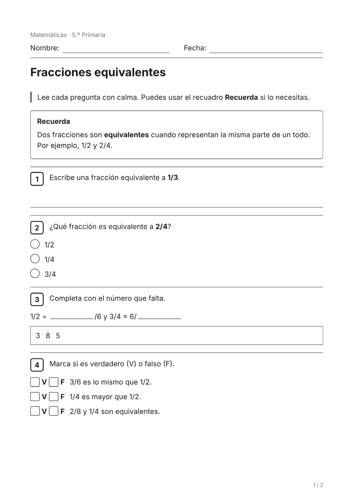
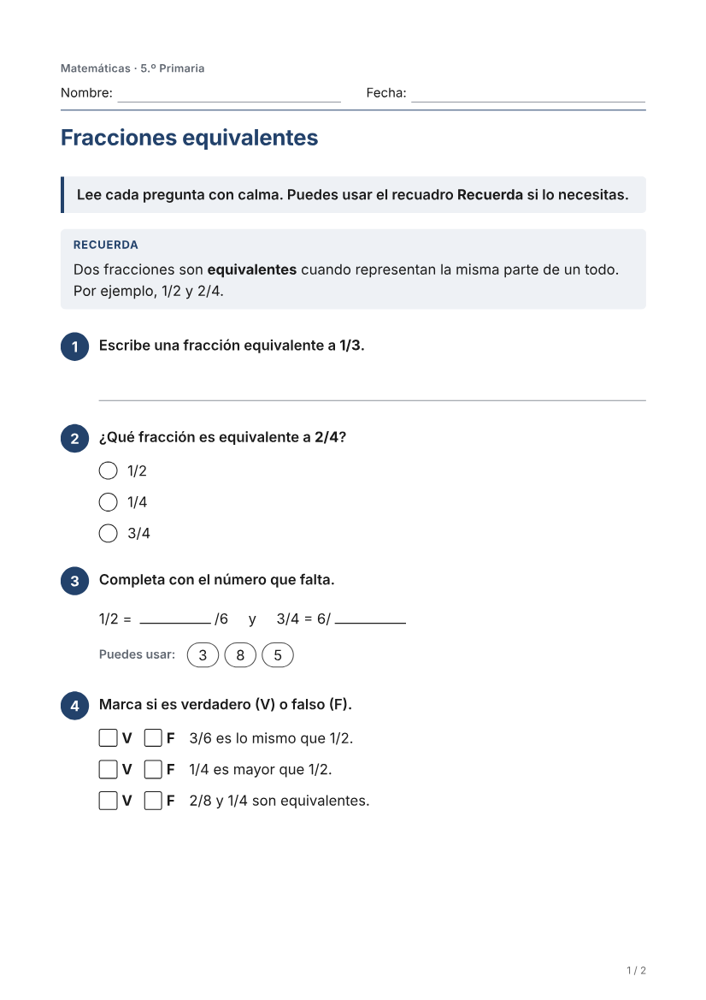
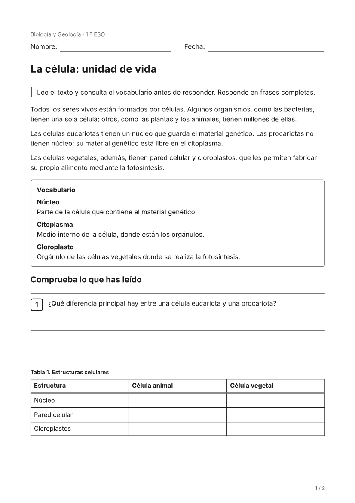
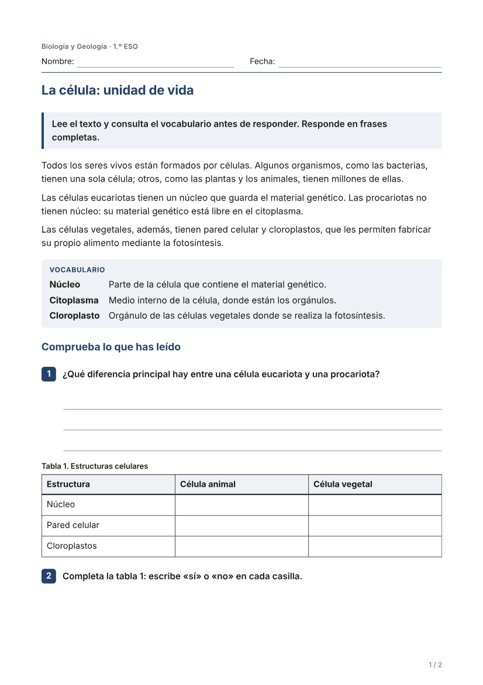
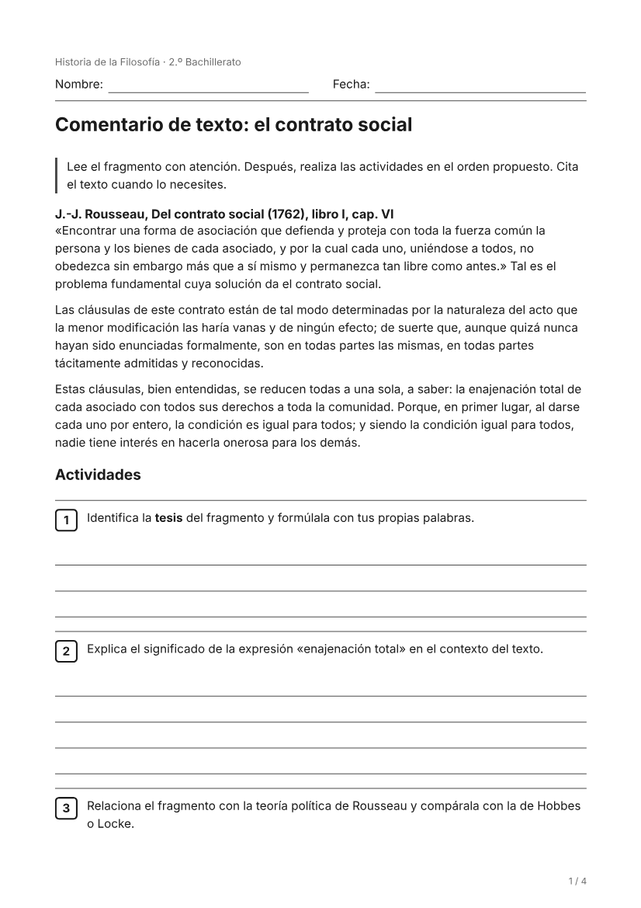
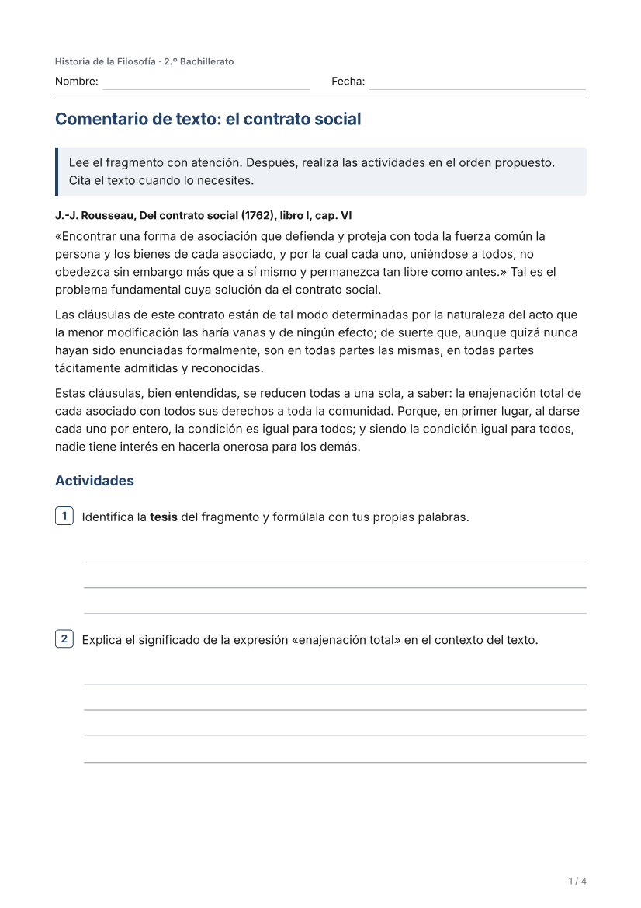

# Phase 8 · QA visual de la ficha del alumno

Cinco fichas sintéticas y deterministas (`tests/visual-qa/fixtures.ts`: sin IA, sin datos reales) renderizadas exactamente como
el producto: `MaterialDocument` → `buildRenderModel` → `renderPrintHtml` → motor PDF de producción (Chromium) → PDF.

| Carpeta | Caso |
| --- | --- |
| `A-primaria` | Primaria (5.º Matemáticas): instrucciones, preguntas cortas y todos los tipos de respuesta habituales |
| `B-primaria-estructurada` | Primaria (4.º Ciencias) con más estructura: instrucción por pasos, texto por partes, 3 tareas por página, más espacio, decoración reducida |
| `C-eso` | ESO (1.º Biología): texto, vocabulario, tabla que se rellena, selección múltiple, inicios de frase |
| `D-bachillerato` | Bachillerato (2.º Filosofía): comentario de texto denso, requisitos de extensión, planificador |
| `E-visual` | ESO (1.º Geografía): recorte del original (climograma) del que dependen las preguntas, gráfico con su tabla |

## Qué hay en cada carpeta

- `ficha.pdf` — el PDF final (A4), el mismo que descarga el docente.
- `pagina-N.png` — cada página del PDF rasterizada a 100 ppp.
- `pagina-N-grises.png` — la misma página en escala de grises (como una fotocopiadora del centro).
- `pantalla.png` — el mismo HTML visto en pantalla, dentro del marco gris del visor. En pantalla la hoja muestra la página
  lógica completa; la paginación física A4 solo existe al imprimir (mismo marcado y mismo CSS, ver «Pantalla y PDF»).

`before/` es el renderer anterior (`material_renderer@v2`) con las mismas fichas; `after/` es el actual (`@v3`). Compararlas
lado a lado es la forma más rápida de revisar el cambio.

## Cómo revisarlo

- En la PR de GitHub: «Files changed» → `docs/qa/phase8/after/<caso>/pagina-1.png` (GitHub muestra las imágenes y, con «rich diff»,
  el antes/después de cada página). Los PDF se abren con «View raw».
- En local: `docs/qa/phase8/after/<caso>/ficha.pdf`.
- Regenerarlo (sin IA, unos segundos): `QA_OUT=docs/qa/phase8/after pnpm qa:visual` (Linux; usa el Chromium del motor PDF).

## Ver una página

| | Antes (`@v2`) | Después (`@v3`) |
| --- | --- | --- |
| Primaria |  |  |
| ESO |  |  |
| Bachillerato |  |  |
